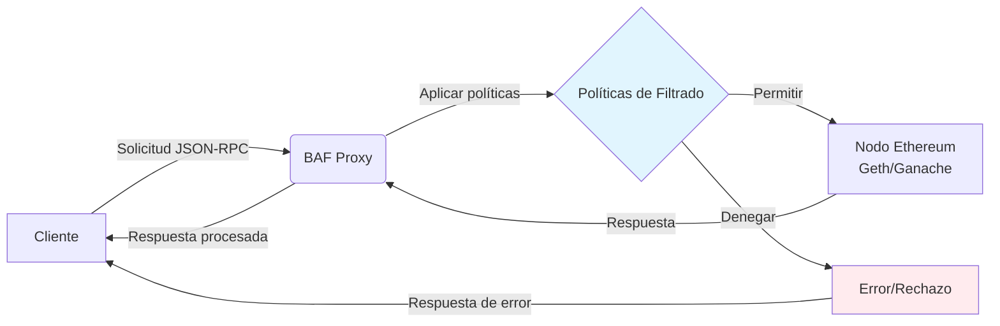

# NodeGuard — Blockchain Application Firewall (BAF)

NodeGuard BAF es un proxy JSON-RPC para Ethereum que inspecciona y filtra cada petición antes de reenviarla a un nodo upstream, aplicando reglas estáticas y heurísticas para bloquear transacciones peligrosas y abusos de API en entornos de desarrollo y prueba.

***

## Tabla de contenidos

- [Descripción](#descripci%C3%B3n)
- [Características](#caracter%C3%ADsticas)
- [Arquitectura](#arquitectura)
- [Requisitos del sistema](#requisitos-del-sistema)
- [Instalación](#instalaci%C3%B3n)
    - [Node.js y npm (nvm)](#nodejs-y-npm-nvm)
    - [Redis](#redis)
    - [Dependencias del proyecto](#dependencias-del-proyecto)
    - [TypeScript](#typescript)
    - [Ganache (opcional)](#ganache-opcional)
    - [Geth (opcional)](#geth-opcional)
- [Configuración (.env)](#configuraci%C3%B3n-env)
- [Compilar y arrancar](#compilar-y-arrancar)
- [Uso y pruebas rápidas](#uso-y-pruebas-r%C3%A1pidas)
- [Ejecución de tests](#ejecuci%C3%B3n-de-tests)
- [Métricas y monitorización](#m%C3%A9tricas-y-monitorizaci%C3%B3n)
- [Buenas prácticas de seguridad](#buenas-pr%C3%A1cticas-de-seguridad)
- [Resolución de problemas](#resoluci%C3%B3n-de-problemas)
- [Limitaciones y aviso legal](#limitaciones-y-aviso-legal)
***


## Características

- Proxy JSON-RPC con inspección previa y políticas de denegación/permitir por método y parámetros.
- Reglas estáticas y heurísticas contra transacciones maliciosas, picos de gas/valor, métodos peligrosos y abuso de consultas.
- Mitigación de numerosos ataques comunes en Blockchain.
- Rate limiting con Redis para estado y telemetría de seguridad.
- Endpoint de métricas Prometheus (/metrics) para observabilidad.
- Dashboard para visualización monitorización
- Muchas más características descritas en la memoria de este proyecto.

***

## Arquitectura

# Diagrama de flujo BAF Proxy



***

## Requisitos del sistema

- Hardware mínimo:
    - 2 vCPUs
    - 4 GB RAM (8 GB recomendado si el mismo host ejecuta Geth)
    - 20 GB de disco libre
    - Conectividad hacia el nodo upstream
- Software:
    - Ubuntu 22.04 LTS o 24.04 LTS
    - Node.js v18+ y npm
    - Redis v6+
    - Geth o Ganache (para upstream de pruebas)
    - Opcional: Prometheus + Grafana

***

## Instalación

Sigue los pasos sobre una instalación limpia de Ubuntu 22.04/24.04.

### Node.js y npm (nvm)

Se recomienda instalar Node.js mediante nvm para facilitar el uso de versiones LTS y aislar entornos por proyecto.

```bash
curl -o- https://raw.githubusercontent.com/nvm-sh/nvm/v0.39.3/install.sh | bash
source ~/.bashrc
nvm install 20
nvm use 20
node -v
npm -v
```


### Redis

Instala y habilita Redis como servicio del sistema y valida su estado con redis-cli.

```bash
sudo apt update
sudo apt install redis-server -y
sudo systemctl enable redis-server
sudo systemctl start redis-server
redis-cli ping   # debe devolver "PONG"
```


### Dependencias del proyecto

```bash
cd ~/baf
npm install
sudo apt-get install -y build-essential python3-dev
```


### TypeScript

```bash
sudo npm install -g typescript ts-node
tsc -v
```


### Ganache (opcional)

Ganache es un simulador de blockchain local para Ethereum que facilita pruebas rápidas con cuentas precargadas.

```bash
sudo npm install -g ganache
ganache --server.port 8545 --chain.networkId 31337 --chain.chainId 31337 \
  --wallet.totalAccounts 20 --wallet.defaultBalance 1000 \
  --wallet.mnemonic "test test test test test test test test test test test junk"
```


### Geth (opcional)

Geth es el cliente oficial de Ethereum en Go, útil para conectarse a mainnet/testnets o levantar un nodo local.

```bash
sudo add-apt-repository -y ppa:ethereum/ethereum
sudo apt-get update
sudo apt-get install -y geth
geth version
```


***

## Configuración (.env)

Crea un archivo `.env` en la raíz del proyecto (o exporta variables en el entorno). No compartas valores reales de secretos.

```env
# NodeGuard BAF Environment Configuration
ADMIN_PASSWORD=change_me_admin_password
NODE_ENV=development
PORT=3000

# Redis Configuration
REDIS_URL=redis://localhost:6379
REDIS_PASSWORD=

# Rate Limiting
RATE_LIMIT_WINDOW=900
RATE_LIMIT_MAX_REQUESTS=1000

# Security
JWT_SECRET=please_replace_with_a_long_random_secret
SESSION_SECRET=please_replace_with_a_long_random_secret

# Performance / Logging
METRICS_ENABLED=true
PERFORMANCE_MONITORING=true
BAF_CONSOLE_LOGS=false
```

Nota: con `BAF_CONSOLE_LOGS=false`, los logs se guardarán en el directorio `/logs` y se mostrará el banner de inicialización de NodeGuard al arrancar.

***

## Compilar y arrancar

```bash
# Compilar TypeScript
npm run build

# (Opcional) Levantar Ganache antes de iniciar
ganache --server.port 8545 --chain.networkId 31337 --chain.chainId 31337 \
  --wallet.totalAccounts 20 --wallet.defaultBalance 1000 \
  --wallet.mnemonic "test test test test test test test test test test test junk"

# Arrancar en modo producción
npm start

# o en modo desarrollo (watch / sourcemaps)
npm run dev
```


***

## Uso y pruebas rápidas

- Consultar número de bloque (validación de conectividad JSON-RPC a través del BAF):

```bash
curl -X POST http://localhost:3000/rpc \
  -H "Content-Type: application/json" \
  -d '{"jsonrpc":"2.0","method":"eth_blockNumber","params":[],"id":1}'
```

- Enviar transacción de ejemplo:

```bash
curl -X POST http://localhost:3000/rpc \
  -H "Content-Type: application/json" \
  -d '{"jsonrpc":"2.0","method":"eth_sendTransaction","params":[{...}],"id":2}'
```

- Consultar métricas (Prometheus text format):

```bash
curl http://localhost:3000/metrics
```

- Probar reglas de seguridad (transacciones simuladas que deberían bloquearse por diferentes motivos):

```bash
curl -X POST http://localhost:3000/rpc -H "Content-Type: application/json" \
  -d '{"jsonrpc":"2.0","method":"eth_sendTransaction","params":[{"from":"0xa0Ee7A142d267C1f36714E4a8F75612F20a79720","to":"0xb687FE7E47774B22F10Ca5E747496d81827167E3","value":"0x1000000000000000","gas":"0x5208","gasPrice":"0x4A817C800","nonce":"0x0","chainId":"0x7a69"}],"id":5}'

curl -X POST http://localhost:3000/rpc -H "Content-Type: application/json" \
  -d '{"jsonrpc":"2.0","method":"eth_sendTransaction","params":[{"from":"0xD51d4b680Cd89E834413c48fa6EE2c59863B738d","to":"0xb687FE7E47774B22F10Ca5E747496d81827167E3","value":"0x1","gas":"0x5208","gasPrice":"0x1","nonce":"0x1","chainId":"0x7a69"}],"id":4}'
```


***

## Ejecución de tests

- Test individual / sistema:

```bash
npm run test baf/tests/threat-scenarios/replay-defense.test.js
python3 baf/tests/system/system-test.py
./baf/tests/system/test-all-endpoints.sh
```

- Ejecutar todos los tests de una carpeta:

```bash
npm run test baf/tests/threat-scenarios
npm run test baf/tests/unit
```

- Ejecutar toda la suite del proyecto:

```bash
npm run test
```


***

## Métricas y monitorización

- Expón métricas en `/metrics` con formato Prometheus activando `METRICS_ENABLED=true`.
- Recopila con Prometheus y visualiza en Grafana.
- Mide latencias de Redis y del upstream para diagnosticar cuellos de botella.

***

## Buenas prácticas de seguridad

- Mantén `ADMIN_PASSWORD`, `JWT_SECRET` y `SESSION_SECRET` fuera del control de versiones; rota periódicamente.
- Endurece reglas y umbrales de rate limiting para entornos compartidos.
- Separa entornos (dev/staging/prod) con archivos `.env` específicos y credenciales distintas.
- Revisa logs periódicamente y habilita alertas sobre eventos de denegación y errores 5xx.

***

## Resolución de problemas

- BAF no arranca:
    - Revisa logs de la app (stdout/stderr o carpeta `/logs` si `BAF_CONSOLE_LOGS=false`).
    - Comprueba Redis: `redis-cli ping` debe devolver `PONG`.
    - Verifica la conectividad al upstream y la configuración de `UPSTREAM_URL`.
- Las reglas no se aplican:
    - Verifica el token/credencial al llamar al Admin API (si aplica).
    - Revisa que `baf:rules:static` en Redis contenga JSON válido.
    - Valida el formato con `jq` u otra herramienta.
- Muchos falsos positivos:
    - Cambia a modo observación y analiza logs.
    - Ajusta umbrales/reglas y repite pruebas.
- Latencias por Redis:
    - Mide con `redis-cli --latency`.
    - Acerca Redis al BAF (misma zona/red) para reducir RTT.

***

## Limitaciones y aviso legal

Este proyecto y sus ejemplos están destinados a investigación, docencia y pruebas en entornos controlados. No despliegues ni utilices técnicas ofensivas o bots de prueba en redes públicas. Respeta licencias y términos de uso de redes y servicios.

***
